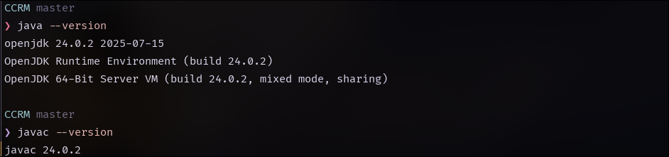
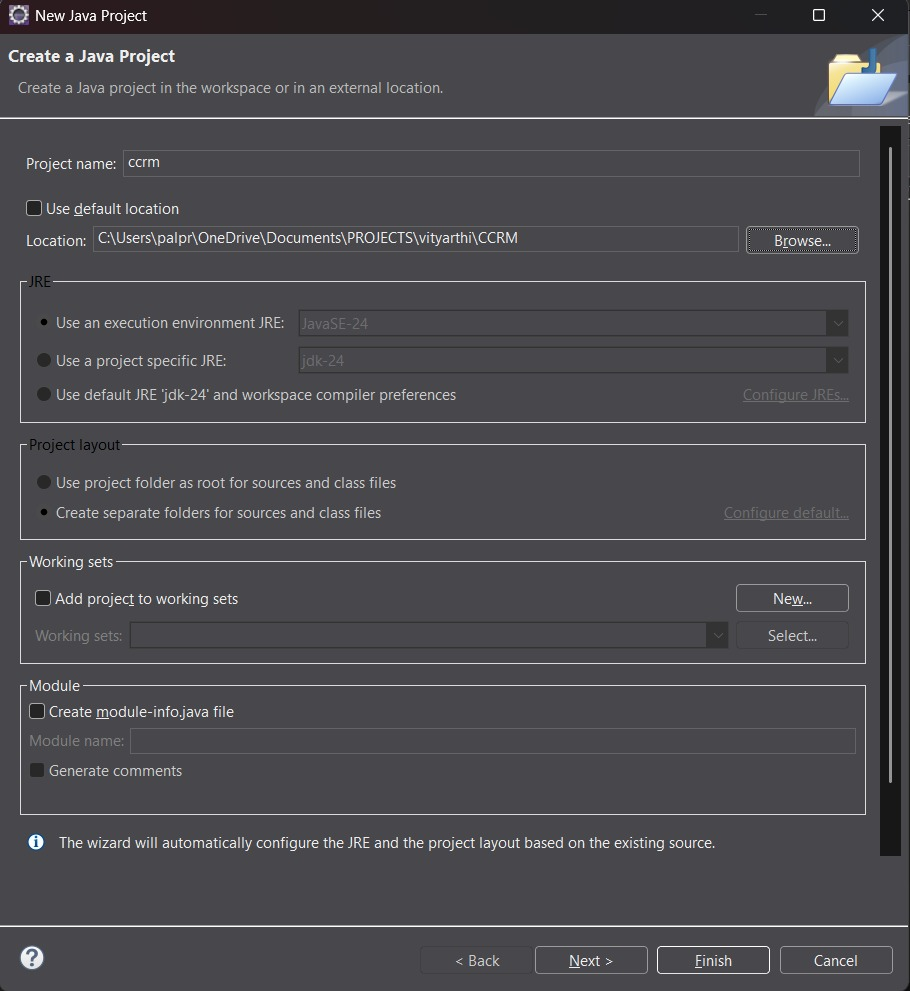

# Campus Course & Records Manager (CCRM)

## Project Overview
This project is a Command-Line Interface (CLI) application for managing student, instructor, course, and enrollment records. It demonstrates key Java programming concepts and design patterns, including **Object-Oriented Programming (OOP)** principles, the **Builder** and **Singleton** design patterns, robust **exception handling**, and modern **file I/O** using NIO.2 and the Stream API. The application provides a persistent and reliable system for managing academic records.

### Prerequisites

- **JDK Version**: Java 11 or higher
- **IDE**: Eclipse IDE for Java Developers (recommended)
- **Operating System**: Windows 10/11 (installation guide provided)

### Running the Application

1. Clone the repository:

   ```bash
   git clone [your-repository-url]
   cd CCRM
   ```

2. Compile the project:

   ```bash
   javac -d bin src/edu/ccrm/**/*.java
   ```

3. Run the application:

   ```bash
   java -cp bin edu.ccrm.cli.Main
   ```

4. **Enable Assertions** (recommended for testing):

   ```bash
   java -ea -cp bin edu.ccrm.cli.Main
   ```
   
## Key Features Implemented
* **Student Management**: Add, list, update, and delete student records.
* **Course Management**: Add and list course details using the **Builder Pattern**.
* **Instructor Management**: Add and list instructor profiles.
* **Enrollment & Grading**: Enroll students in courses, record grades, and calculate GPA. This section demonstrates **custom exception handling** for business rule violations.
* **Data Persistence**: Export and import data to/from text files using **Java Streams** and **NIO.2**.
* **Data Backup**: Create a complete, timestamped backup of the data folder using a **recursive file-walking utility**.
* **Reports**: Generate a sorted Student GPA report and a course grade distribution report using the **Stream API**.

### Java Timeline - Key Milestones

- **1991**: Java project started at Sun Microsystems (originally named "Oak")
- **1995**: Java 1.0 released - "Write Once, Run Anywhere" philosophy
- **1997**: Java 1.1 - Inner classes, JavaBeans, JDBC introduced
- **1998**: Java 2 (J2SE 1.2) - Collections framework, Swing GUI toolkit
- **2000**: J2SE 1.3 - HotSpot JVM, Java Sound API
- **2002**: J2SE 1.4 - Regular expressions, NIO, XML processing
- **2004**: Java 5 (J2SE 1.5) - Generics, annotations, enums, enhanced for-loop
- **2006**: Java 6 (J2SE 6) - Performance improvements, scripting support
- **2011**: Java 7 - Diamond operator, try-with-resources, NIO.2
- **2014**: Java 8 - Lambda expressions, Stream API, functional interfaces
- **2017**: Java 9 - Module system, JShell, reactive streams
- **2018**: Java 10 - Local variable type inference (var keyword)
- **2018**: Java 11 - LTS release, HTTP client, string methods
- **2019**: Java 12-13 - Switch expressions, text blocks preview
- **2020**: Java 14-15 - Pattern matching, records preview
- **2021**: Java 16-17 - LTS release, sealed classes, pattern matching
- **2022-2024**: Java 18-21 - Virtual threads, pattern matching enhancements

## Java Editions Comparison

| Feature               | Java ME (Micro Edition)          | Java SE (Standard Edition)       | Java EE (Enterprise Edition)         |
| --------------------- | -------------------------------- | -------------------------------- | ------------------------------------ |
| **Target Platform**   | Mobile devices, embedded systems | Desktop applications, servers    | Enterprise web applications          |
| **Application Types** | Mobile apps, IoT devices         | Standalone applications, applets | Web services, enterprise apps        |
| **Core APIs**         | Limited subset of Java APIs      | Complete Java API set            | Java SE + additional enterprise APIs |
| **Memory Footprint**  | Minimal (KBs to few MBs)         | Moderate (10s to 100s of MBs)    | Large (100s of MBs to GBs)           |
| **Key Technologies**  | CLDC, MIDP, CDC                  | Swing, AWT, NIO, Collections     | Servlets, JSP, EJB, JPA, CDI         |
| **Examples**          | Feature phones, smart cards      | NetBeans, Eclipse, desktop tools | Banking systems, e-commerce          |
| **Current Status**    | Legacy (replaced by Android)     | Active development               | Transferred to Eclipse Foundation    |


## Java Architecture: JDK, JRE, JVM

### Java Virtual Machine (JVM)

The **JVM** is the runtime environment that executes Java bytecode. It provides:

- **Platform Independence**: Same bytecode runs on different operating systems
- **Memory Management**: Automatic garbage collection
- **Security**: Sandboxed execution environment
- **Performance**: Just-In-Time (JIT) compilation for optimization

### Java Runtime Environment (JRE)

The **JRE** contains everything needed to run Java applications:

- **JVM**: The core runtime engine
- **Core Libraries**: Essential Java APIs (java.lang, java.util, etc.)
- **Supporting Files**: Configuration files and resources
- **Note**: JRE = JVM + Core Libraries + Other Components

### Java Development Kit (JDK)

The **JDK** is the complete development environment:

- **JRE**: Everything needed to run Java applications
- **Development Tools**: Compiler (javac), debugger (jdb), documentation (javadoc)
- **Additional Utilities**: JAR tool, monitoring tools, profilers
- **Note**: JDK = JRE + Development Tools

### Interaction Flow

```
Source Code (.java) → [javac] → Bytecode (.class) → [JVM] → Native Machine Code → Execution
```

1. **Development**: Write Java source code using JDK tools
2. **Compilation**: javac compiler converts source to platform-neutral bytecode
3. **Execution**: JVM loads bytecode and converts to native machine code
4. **Runtime**: Application runs with JRE providing necessary libraries and services

## Java Installation on Windows

### Step-by-Step Installation Guide

#### Step 1: Download JDK

1. Visit [Oracle JDK Downloads](https://www.oracle.com/java/technologies/downloads/) or [OpenJDK](https://openjdk.org/)
2. Select **Windows x64 Installer** for your version (Java 11+ recommended)
3. Download the `.exe` file.

#### Step 2: Install JDK

1. Run the downloaded installer as Administrator
2. Follow installation wizard (accept default paths)
3. Installation typically goes to `C:\Program Files\Java\jdk-[version]`

#### Step 3: Set Environment Variables

1. Open **System Properties** → **Advanced** → **Environment Variables**
2. Create **JAVA_HOME** variable:
   - Variable name: `JAVA_HOME`
   - Variable value: `C:\Program Files\Java\jdk-[version]`
3. Update **PATH** variable:
   - Add `%JAVA_HOME%\bin` to the PATH
   
#### Step 4: Verify Installation

Open Command Prompt and run:

```bash
java -version
javac -version
```

**Screenshot: Java Installation Verification**

_Figure 1: Verifying Java installation with version commands_

## Eclipse IDE Setup

### Installation Steps

1. Download **Eclipse IDE for Java Developers** from [eclipse.org](https://www.eclipse.org/downloads/)
2. Extract the downloaded archive to desired location
3. Launch Eclipse and select workspace location

### Creating New Java Project

1. **File** → **New** → **Java Project**
2. Project name: `CCRM`
3. Use default JRE(should match your installed JDK)
4. Create `src` folder structure with packages

**Screenshot: Eclipse Project Setup**

_Figure 2: Creating new Java project in Eclipse IDE_

### Run Configuration

1. Right-click on main class → **Run As** → **Java Application**
2. Configure run arguments if needed
3. Set up assertions: **Run Configurations** → **Arguments** → **VM arguments**: `-ea`

### Syllabus Topic Mapping
| **Syllabus Topic** | **File / Class / Method Where Demonstrated** |
| :--- | :--- |
| Object-Oriented Programming (OOP) | Person.java, Student.java, Instructor.java (Inheritance, Encapsulation, Polymorphism)|
| Custom Exceptions | DuplicateEnrollmentException.java, MaxCreditLimitExceededException.java |
| Exception Handling (try-catch)| CCRMApp.java (in manageEnrollment() and manageFileOperations()) |
|Java Streams & Lambdas|ReportService.java (generateStudentGpaReport()), ImportExportService.java (in exportData() and importData())|
|NIO.2 (New I/O)|ImportExportService.java (backupData(), exportData(), importData())|
|Design Patterns (Builder)|Course.java|
|Design Patterns (Singleton)|StudentService.java, CourseService.java etc. (created as single instances in CCRMApp)|
|Recursive Algorithms|ImportExportService.java (backupData() uses Files.walkFileTree)|

## Project Structure
The project is organized into logical packages to separate concerns and adhere to best practices.

* **edu.ccrm.domain**: Contains the core data model classes and enums. It demonstrates **Inheritance** (`Student` and `Instructor` from `Person`), **Encapsulation** (private fields with getters/setters), and **Polymorphism** (`toString` and `equals` methods). It also includes custom exceptions (`DuplicateEnrollmentException`, `MaxCreditLimitExceededException`) and implements the **Builder Pattern** for the `Course` class.
* **edu.ccrm.io**: Handles all file-related operations. It uses **NIO.2** for file handling and **Streams** for efficient data processing during import and export. It also includes a **recursive file backup utility**.
* **edu.ccrm.service**: This is the business logic layer. It includes a generic **`DataService` interface** and concrete service classes for each entity (`StudentService`, `CourseService`, `InstructorService`, `EnrollmentService`, `ReportService`). This demonstrates **polymorphism** and the **Singleton Pattern** (via the service instances in the main app).
* **edu.ccrm.cli**: Contains the main `CCRMApp` class, which serves as the application's entry point and menu-driven **Command-Line Interface (CLI)**.
* **edu.ccrm.util**: An optional package for utility classes, such as the `LogUtil` class, which provides consistent logging functionality.

## Enabling Assertion

Assertions are used throughout the application to verify invariants and preconditions. To enable assertions:

### Command Line

```bash
# Enable all assertions
java -ea edu.ccrm.cli.Main

# Enable for specific package
java -ea:edu.ccrm.domain... edu.ccrm.cli.Main

# Enable system assertions
java -esa edu.ccrm.cli.Main
```

## Acknowledgments

This project was developed as part of Java Programming coursework, demonstrating comprehensive usage of Java SE features, OOP principles, and software engineering best practices. All code is original implementation following academic integrity guidelines.

### References

- **Official Java Documentation**:
   - [Oracle Java Documentation](https://docs.oracle.com/en/java/)
- **Books for Deeper Understanding**:
   - "Clean Code: A Handbook of Agile Software Craftsmanship" by Robert C. Martin
   - "Head First Java" by Kathy Sierra and Bert Bates
   - "Java Concurrency in Practice" by Brian Goetz
- **Online Learning Platforms/Communities**:
   - [Baeldung](https://www.baeldung.com/)
   - [Stack Overflow](https://stackoverflow.com/questions/tagged/java)

---

**Author**: PATEL YUG MAHESHKUMAR<br> 
**Reg. No.**: 25BAI10675<br>
**Course**: (CSE2006) Programming in Java</br>
**Institution**: Vellore Institute of Technology, Bhopal 
